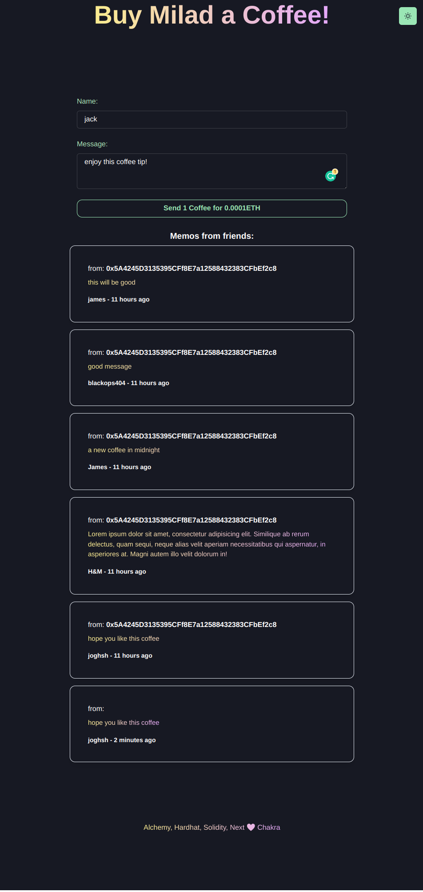

#  Alchemy, Hardhat, Solidity, Nextjs ❤️ Chakra [chakra-ui](https://github.com/chakra-ui/chakra-ui) and TypeScript

A Dapp for sending tip to your friend.

[Demo](https://buy-me-coffee-dapp.vercel.app/)

## how to setup
1- for deploy new contract go to `contract` folder and follow the README there

2- for deploy the front, after you deployed the contract, copy the contract address and update it with the example in
 `src/pages/index.tsx`.

3- after step 2, just run `yarn dev` 

 

